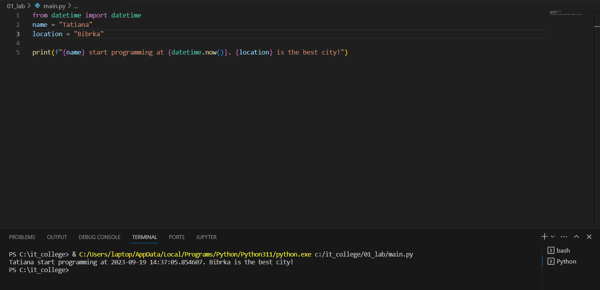
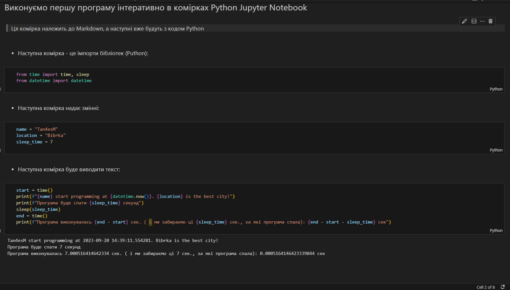

# Звіт до роботи №1
## Тема: _Оформлення та здача робіт_
### Мета роботи: _навчитись роботі з форматуванням Markdown та створювати звіти з використанням файлів README_
---
### Виконання роботи
- Результати виконання завдання:
    1. Виконали першу програму, результат виконання: 
    1. Модифікували програму та використали [Python Notebook для її виконання](nb.ipynb)
    1. Після виконання всіх клітинок Python ноутбуку програма вивела: 
    1. зробили запит до ChatGPT щоб написав та поясним першу програму. Модифікували його відповідь на на її основі зробили [новий Python Notebook](ai.ipynb)
    1. Запитались в ChatGPT як працювати з змінними. Його відповідь також була вставлена у [Python Notebook](ai.ipynb);
    1. Після виконання всіх комірок, оформили звіт та закомітили всі зміни до репозиторію;
    1. Навчились створювати першу програму, працювати у Python Notebook, ставили запитання до ChatGPT та формутували його відповідь у відповідні клітинки Python Notebook;

- Код першої програми, яку запропонував ChatGPT:
     ```python
    print("Привіт, світе!")
---
- ChatGPT не вміє формутувати клітинки Python Notebook, тому запропонував наступне:

 ```text
    Щоб створити новий блок у Jupyter Notebook для вставки коду     Python та пояснення у форматі Markdown, вам потрібно    вставити код Python у блок з кодом та пояснення у блок з   Markdown. Це може виглядати так:
```
 `[Клітинка з кодом]`
 ```python
 # Ваш код тут
 ```
 `[Клітинка з Markdown]`
 ```
 Ось наша програма. Вона виводить привітання на екран.
 ```
 ---
 -  індивідуального завдання небуло;

 ### Висновок:
 - :question: Що зроблено в роботі: навчились працювати з форматуванням Markdown, створили першу програму на Python, навчились працювати у Notebook, та задали запит до ChatGPT :white_check_mark:
- :question: Чи досягнуто мети роботи: все зроблено :white_check_mark:
- :question: Які нові знання отримано: вперше попрацювали в Python Notebooks :notebook_with_decorative_cover:
- :question: Чи вдалось відповісти на всі питання задані в ході роботи: так :100:
- :question: Чи вдалося виконати всі завдання: так :100:
- :question: Чи виникли складності у виконанні завдання: так, на початку роботи :oops:
- :question: Чи подобається такий формат здачі роботи (Feedback): :ok_hand:
- :question: Побажання для покращення (Suggestions): все :ok_hand:
---